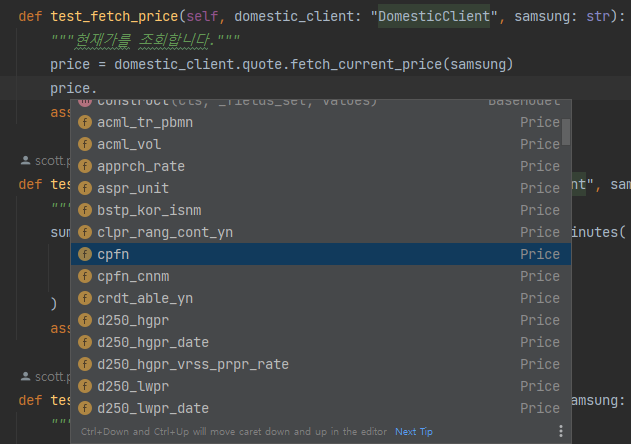
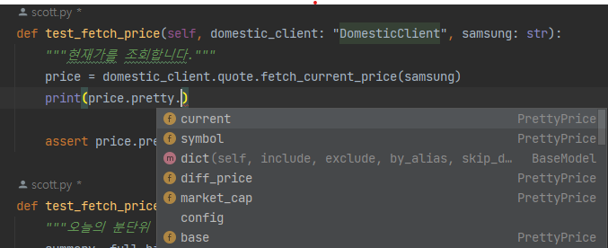

# kis-client

> [한국투자증권 OpenAPI](https://apiportal.koreainvestment.com/apiservice/oauth2#L_5c87ba63-740a-4166-93ac-803510bb9c02)

한국투자증권 API를 사용하기 위한 python client입니다.
국내/해외 주식의 시세 조회/주문/잔고 조회 기능을 제공합니다.
OpenAPI 에서는 매 요청마다 token, Hashkey 등을 사용하여 인증해야하는데, kis-client를 통해 쉽게 인증을 처리할 수 있습니다.

## 주의사항

kis-client는 실계좌에서의 매수/매도 주문을 전송할 수 있습니다. 
본 repo의 코드를 사용함으로써 발생한 모든 문제는 사용자의 책임입니다.
반드시 모의투자 환경에서 테스트가 완료된 후에 실계좌에서 사용하시기 바랍니다.


# Get Started


## Setting

kis-client 를 사용하기 위해서는 먼저 한국투자증권 페이지에서 OpenAPI 개발자로 신청해야 합니다.
개발자 신청 후 받은 app_key, app_secret 을 활용하여 작동합니다.

> 현재 kis-client는 python 3.8 버전에서 정상 작동합니다.

```bash
# git clone
git clone git@github.com:softyoungha/kis-client.git

# move directory
cd kis-client

# 가상환경 생성
python -m venv venv

# 필요 라이브러리 설치
pip install -r requirements.txt

# kis client configuration
python -m kis config init
# ✔ 증권계좌번호 (예: 12345678-01): 87654321-01
# ✔ app_key: ...
# ✔ app_secret: yyy
# ✔ 모의투자 여부 [n]: y
# [2023-08-15 16:34:41,868] INFO client.py:123 DomesticClient(모의투자 account='xxxxxxxx-xx') initialized
# [2023-08-15 16:34:41,903] INFO session.py:51 Token file is loaded: ~\.kis\xxxxxxxx-xx\token.yaml
# ✔ profile_name  [default]:

# show configuration
python -m kis config show 
```


## kis-client configuration

### `kis config init`

다음의 cli로 kis-client에 필요한 configuration을 설정합니다.

```bash
(venv) $ python -m kis config init
```

```text
# prompts
✔ 증권계좌번호 (예: 12345678-01): 87654321-01
✔ app_key: ...
✔ app_secret: yyy
✔ 모의투자 여부 [n]: y
[2023-08-15 16:34:41,868] INFO client.py:123 DomesticClient(모의투자 account='xxxxxxxx-xx') initialized
[2023-08-15 16:34:41,903] INFO session.py:51 Token file is loaded: ~\.kis\xxxxxxxx-xx\token.yaml
✔ profile_name  [default]:
😁new profile 'default' added!
```

설정이 정상적으로 완료되었다면 다음의 커맨드로 정상 조회할 수 있습니다.

```bash
(venv) $ python -m kis config show "default"
```

```text
# output
[default]
✔ 증권계좌번호:         xxxxxxxx-xx
✔ app_key:              xxx
✔ app_secret:           yyy
✔ 모의투자 여부:        True
```

이후 python 내부에서 KisClient에 입력한 profile_name(예시에서는 `default`)을 인자로 넘겨서 사용합니다.

```python
# 한국투자증권 국내 주식 client 생성
client = DomesticClient(profile_name="default")

# 삼성전자 현재가 정보 조회
client.quote.fetch_current_price("005930")
```


### 직접 입력

`kis config init`을 먼저 하지 않더라도 credential 정보를 알고 있다면 python 내부에서 직접 입력하여 사용할 수 있습니다.

```python
# account, app_key, app_secret, is_dev(모의투자여부) 모두 입력되어야합니다.
client = DomesticClient(
    account="xxxxxxxx-xx",
    app_key="xxx",
    app_secret="yyy",
    is_dev=True,
)
```


### 환경변수 사용

환경변수로 입력받은 정보를 사용할 수 있습니다.
```bash
# 환경변수 입력 windows git bash, linux, macOS
export KIS_APP_KEY="xxx"
export KIS_APP_SECRET="yyy"
export KIS_ACCOUNT="xxxxxxxx-xx"

# windows cmd, powershell
set KIS_APP_KEY="xxx"
set KIS_APP_SECRET="yyy"
set KIS_ACCOUNT="xxxxxxxx-xx"
```

```python
# is_dev(모의투자여부)만 입력되고 나머지는 환경변수로 입력받음
client = DomesticClient(is_dev=True)
```


# Usage

## 1. DomesticClient - 국내 주식

국내 주식 시세 조회/주문/잔고 조회를 위해서는 `DomesticClient`를 사용합니다. 

```python
from kis.core import DomesticClient

client = DomesticClient(profile_name="default")

# quote: 시세 조회를 위한 method group
price_info = client.quote.fetch_current_price("005930")

# order: 주문을 위한 method group
order_response = client.order.buy(symbol="005930", quantity=10, price=10000)

# balance: 잔고 조회를 위한 method group
my_balance = client.balance.fetch()
```

각 group별 메소드 사용법은 테스트 코드에서 확인하실 수 있습니다.

- tests/unit/domestic/test_balance.py
- tests/unit/domestic/test_order.py
- tests/unit/domestic/test_quote.py


## 2. OverseasClient - 해외 주식

해외 주식 시세 조회/주문/잔고 조회를 위해서는 `OverseasClient`를 사용합니다. 

```python
from kis.core import OverseasClient

client = OverseasClient(profile_name="default")

# quote: 시세 조회를 위한 method group
price_info = client.quote.fetch_current_price("AAPL")

# order: 주문을 위한 method group
order_response = client.order.buy(symbol="AAPL", quantity=10, price=10000)

# balance: 잔고 조회를 위한 method group
my_balance = client.balance.fetch()
```

각 group별 메소드 사용법은 테스트 코드에서 확인하실 수 있습니다.

- tests/unit/overseas/test_balance.py
- tests/unit/overseas/test_order.py
- tests/unit/overseas/test_quote.py

## 3. Test 코드 실행방법

> **[주의]** 테스트 코드는 반드시 모의투자 신청 후 받은 모의투자 계정으로 실행하세요.
> test_order.py 에서는 실제 주식 매수/매도가 일어나므로 주의해야합니다.
> 발생한 문제는 본 레포지토리에서 책임지지 않습니다.


## 4. 종목 리스트 조회

전체 종목 리스트를 조회해서 python DataFrame 형태로 가져올 수 있습니다.

```python
from kis.core import MasterBook

# kospi 종목 리스트 조회
kospi_df = MasterBook.get("kospi")

# kosdaq 종목 리스트 조회
kosdaq_df = MasterBook.get("kosdaq")

# 한국거래소 전체(KOSPI + KOSDAQ) 종목 리스트 조회
kospi_df = MasterBook.get("KRX") 

# nasdaq 종목 리스트 조회
nasdaq_df = MasterBook.get("nasdaq")

# nyse 종목 리스트 조회
nyse_df = MasterBook.get("nyse")

# amex 종목 리스트 조회
amex_df = MasterBook.get("amex")

# 미국 거래소 전체(nasdaq + nyse + amex) 종목 리스트 조회
usa_df = MasterBook.get("USA")
```


# Advanced

### 1. pydantic model support

한국투자증권에서 제공하는 raw response 각 field들에 대해서 pydantic model을 정의하여 validation을 거칩니다.
raw response는 전부 `str` type 데이터이지만 먼저 정의해놓은 pydantic BaseModel을 통해 각 field들의 type을 변환합니다.

```python
# from kis.core.domestic.schema.quote_schema import Price

class Price(BaseModel):
    """
    국내주식주문/주식현재가 시세 - Response Body output 응답상세

    See https://apiportal.koreainvestment.com/apiservice/oauth2#L_5c87ba63-740a-4166-93ac-803510bb9c02
    """
    iscd_stat_cls_code: str = Field(title="종목상태구분코드")
    marg_rate: float = Field(title="증거금 비율")
    rprs_mrkt_kor_name: str = Field(title="대표시장 한글명")
    new_hgpr_lwpr_cls_code: Optional[str] = Field(title="신 고가 저가 구분 코드")
    bstp_kor_isnm: str = Field(title="업종 한글명")
    temp_stop_yn: str = Field(title="임시 정지 여부")
    oprc_rang_cont_yn: str = Field(title="종가 범위 연장 여부")
    clpr_rang_cont_yn: str = Field(title="종가 범위 연장 여부")
    crdt_able_yn: str = Field(title="신용 가능 여부")
    ...
```

각 field마다 type에 맞추어 str/float/int/bool 등으로 변환해주는 작업을 진행하였습니다.

> 잘못된 type의 field가 있을 경우 Issue로 알려주시면 반영하겠습니다. 

IDE(Pycharm, VSCode)를 활용한다면 type annotation을 통해 쉽게 사용할 수 있는 Field를 찾을 수 있습니다.



> `price.`까지 입력하면 필요한 field를 쉽게 찾을 수 있습니다. 

### 2. 시세 조회 pretty model

한국투자증권에서 받아온 시세 정보의 raw 데이터는 다음과 같이 직관적이지 않고 축약된 네이밍을 가지고 있습니다.

<details>
<summary>국내 주식 시세 조회 - Raw JSON Response data</summary>

```json
{
  "output": {
    "iscd_stat_cls_code": "55",
    "marg_rate": "20.00",
    "rprs_mrkt_kor_name": "KOSPI200",
    "bstp_kor_isnm": "전기.전자",
    "temp_stop_yn": "N",
    "oprc_rang_cont_yn": "N",
    "clpr_rang_cont_yn": "N",
    "crdt_able_yn": "Y",
    "grmn_rate_cls_code": "40",
    "elw_pblc_yn": "Y",
    "stck_prpr": "128500",
    "prdy_vrss": "0",
    "prdy_vrss_sign": "3",
    "prdy_ctrt": "0.00",
    "acml_tr_pbmn": "344570137500",
    "acml_vol": "2669075",
    "prdy_vrss_vol_rate": "75.14",
    "stck_oprc": "128500",
    "stck_hgpr": "130000",
    "stck_lwpr": "128500",
    "stck_mxpr": "167000",
    "stck_llam": "90000",
    "stck_sdpr": "128500",
    "wghn_avrg_stck_prc": "129097.23",
    "hts_frgn_ehrt": "49.48",
    "frgn_ntby_qty": "0",
    "pgtr_ntby_qty": "287715",
    "pvt_scnd_dmrs_prc": "131833",
    "pvt_frst_dmrs_prc": "130166",
    "pvt_pont_val": "128333",
    "pvt_frst_dmsp_prc": "126666",
    "pvt_scnd_dmsp_prc": "124833",
    "dmrs_val": "129250",
    "dmsp_val": "125750",
    "cpfn": "36577",
    "rstc_wdth_prc": "38500",
    "stck_fcam": "5000",
    "stck_sspr": "97660",
    "aspr_unit": "500",
    "hts_deal_qty_unit_val": "1",
    "lstn_stcn": "728002365",
    "hts_avls": "935483",
    "per": "19.67",
    "pbr": "1.72",
    "stac_month": "12",
    "vol_tnrt": "0.37",
    "eps": "6532.00",
    "bps": "74721.00",
    "d250_hgpr": "149500",
    "d250_hgpr_date": "20210225",
    "d250_hgpr_vrss_prpr_rate": "-14.05",
    "d250_lwpr": "90500",
    "d250_lwpr_date": "20211013",
    "d250_lwpr_vrss_prpr_rate": "41.99",
    "stck_dryy_hgpr": "132500",
    "dryy_hgpr_vrss_prpr_rate": "-3.02",
    "dryy_hgpr_date": "20220103",
    "stck_dryy_lwpr": "121500",
    "dryy_lwpr_vrss_prpr_rate": "5.76",
    "dryy_lwpr_date": "20220105",
    "w52_hgpr": "149500",
    "w52_hgpr_vrss_prpr_ctrt": "-14.05",
    "w52_hgpr_date": "20210225",
    "w52_lwpr": "90500",
    "w52_lwpr_vrss_prpr_ctrt": "41.99",
    "w52_lwpr_date": "20211013",
    "whol_loan_rmnd_rate": "0.22",
    "ssts_yn": "Y",
    "stck_shrn_iscd": "000660",
    "fcam_cnnm": "5,000",
    "cpfn_cnnm": "36,576 억",
    "frgn_hldn_qty": "360220601",
    "vi_cls_code": "N",
    "ovtm_vi_cls_code": "N",
    "last_ssts_cntg_qty": "43916",
    "invt_caful_yn": "N",
    "mrkt_warn_cls_code": "00",
    "short_over_yn": "N",
    "sltr_yn": "N"
  },
  "rt_cd": "0",
  "msg_cd": "MCA00000",
  "msg1": "정상처리 되었습니다!"
}
```

</details>

<details>
<summary>국내 주식 시세 조회 - Pydantic model</summary>

```python
class Price(BaseModel):
    """
    국내주식주문/주식현재가 시세 - Response Body output 응답상세

    See https://apiportal.koreainvestment.com/apiservice/oauth2#L_5c87ba63-740a-4166-93ac-803510bb9c02
    """
    iscd_stat_cls_code: str = Field(title="종목상태구분코드")
    marg_rate: float = Field(title="증거금 비율")
    rprs_mrkt_kor_name: str = Field(title="대표시장 한글명")
    new_hgpr_lwpr_cls_code: Optional[str] = Field(title="신 고가 저가 구분 코드")
    bstp_kor_isnm: str = Field(title="업종 한글명")
    temp_stop_yn: str = Field(title="임시 정지 여부")
    oprc_rang_cont_yn: str = Field(title="종가 범위 연장 여부")
    clpr_rang_cont_yn: str = Field(title="종가 범위 연장 여부")
    crdt_able_yn: str = Field(title="신용 가능 여부")
    grmn_rate_cls_code: str = Field(title="보증금 비율 구분 코드")
    elw_pblc_yn: str = Field(title="ELW 발행 여부")
    stck_prpr: int = Field(title="주식 가격")
    prdy_vrss: int = Field(title="전일 대비")
    prdy_vrss_sign: str = Field(title="전일 대비 부호")
    prdy_ctrt: float = Field(title="전일 대비 대비율")
    acml_tr_pbmn: int = Field(title="누적 거래대금")
    acml_vol: int = Field(title="누적 거래량")
    prdy_vrss_vol_rate: float = Field(title="전일 대비 거래량 비율")
    stck_oprc: int = Field(title="시가")
    stck_hgpr: int = Field(title="고가")
    stck_lwpr: int = Field(title="저가")
    stck_mxpr: int = Field(title="상한가")
    stck_llam: int = Field(title="하한가")
    stck_sdpr: int = Field(title="기준가")
    wghn_avrg_stck_prc: float = Field(title="가중 평균 주식 가격")
    hts_frgn_ehrt: float = Field(title="HTS 외국인 소진율")
    frgn_ntby_qty: int = Field(title="외국인 순매수 수량")
    pgtr_ntby_qty: int = Field(title="프로그램매매 순매수 수량")
    pvt_scnd_dmrs_prc: float = Field(title="피벗 2차 디저항 가격")
    pvt_frst_dmrs_prc: float = Field(title="피벗 1차 디저항 가격")
    pvt_pont_val: float = Field(title="피벗 포인트 값")
    pvt_frst_dmsp_prc: float = Field(title="피벗 1차 디지지 가격")
    pvt_scnd_dmsp_prc: float = Field(title="피벗 2차 디지지 가격")
    dmrs_val: float = Field(title="	디저항 값")
    dmsp_val: float = Field(title="디지지 값")
    cpfn: int = Field(title="자본금")
    rstc_wdth_prc: float = Field(title="제한 폭 가격")
    stck_fcam: int = Field(title="주식 액면가")
    stck_sspr: int = Field(title="주식 대용가")
    aspr_unit: int = Field(title="호가단위")
    hts_deal_qty_unit_val: int = Field(title="HTS 매매 수량 단위 값")
    lstn_stcn: int = Field(title="상장 주수")
    hts_avls: int = Field(title="HTS 시가총액")
    per: float = Field(title="PER")
    pbr: float = Field(title="PBR")
    stac_month: str = Field(title="결산 월")
    vol_tnrt: float = Field(title="거래량 회전율")
    eps: float = Field(title="EPS")
    bps: float = Field(title="BPS")
    d250_hgpr: float = Field(title="250일 최고가")
    d250_hgpr_date: str = Field(title="250일 최고가 일자")
    d250_hgpr_vrss_prpr_rate: float = Field(title="250일 최고가 대비 현재가 비율")
    d250_lwpr: float = Field(title="250일 최저가")
    d250_lwpr_date: str = Field(title="250일 최저가 일자")
    d250_lwpr_vrss_prpr_rate: float = Field(title="250일 최저가 대비 현재가 비율")
    stck_dryy_hgpr: float = Field(title="주식 연중 최고가")
    dryy_hgpr_vrss_prpr_rate: float = Field(title="연중 최고가 대비 현재가 비율")
    dryy_hgpr_date: str = Field(title="연중 최고가 일자")
    stck_dryy_lwpr: float = Field(title="주식 연중 최저가")
    dryy_lwpr_vrss_prpr_rate: float = Field(title="연중 최저가 대비 현재가 비율")
    dryy_lwpr_date: str = Field(title="연중 최저가 일자")
    w52_hgpr: float = Field(title="52주일 최고가")
    w52_hgpr_vrss_prpr_ctrt: float = Field(title="52주일 최고가 대비 현재가 대비")
    w52_hgpr_date: str = Field(title="52주일 최고가 일자")
    w52_lwpr: float = Field(title="52주일 최저가")
    w52_lwpr_vrss_prpr_ctrt: float = Field(title="52주일 최저가 대비 현재가 대비")
    w52_lwpr_date: str = Field(title="52주일 최저가 일자")
    whol_loan_rmnd_rate: float = Field(title="전체 융자 잔고 비율")
    ssts_yn: str = Field(title="공매도가능여부")
    stck_shrn_iscd: str = Field(title="주식 단축 종목코드")
    fcam_cnnm: str = Field(title="액면가 통화명")
    cpfn_cnnm: str = Field(title="자본금 통화명")
    apprch_rate: Optional[float] = Field(title="접근도")
    frgn_hldn_qty: int = Field(title="외국인 보유 수량")
    vi_cls_code: str = Field(title="VI적용구분코드")
    ovtm_vi_cls_code: str = Field(title="시간외단일가VI적용구분코드")
    last_ssts_cntg_qty: int = Field(title="최종 공매도 체결 수량")
    invt_caful_yn: str = Field(title="투자유의여부")
    mrkt_warn_cls_code: str = Field(title="시장경고코드", description="00: 없음/01: 투자주의/02: 투자경고/03: 투자위험")
    short_over_yn: str = Field(title="단기과열여부")
```

</details>

시세 조회 자체는 간편하지만, 실제 활용을 위해서는 각 Field가 무엇인지 OpenAPI 도큐먼트를 확인하면서 찾아야 합니다.
원하는 Field인지를 확인하는 데에 불편한 점이 있기 때문에, 이를 개선하기 위해 
각 field에 대해 aliasing 작업을 더한 `Pretty class`를 제공합니다.

<details>
<summary>Pretty 예시 - PrettyPrice class </summary>
</details>

```python

class PrettyPrice(BaseModel):
    """국내주식주문/주식현재가 시세 - Response Body output 응답상세 Pretty"""
    # about prices
    upper_bound: int = Field(alias="stck_mxpr", title="상한가", example=80900)
    lower_bound: int = Field(alias="stck_llam", title="하한가", example=43700)
    high: int = Field(alias="stck_hgpr", title="최고가", example=65200)
    current: int = Field(alias="stck_prpr", title="현재가", example=65000)
    low: int = Field(alias="stck_lwpr", title="최저가", example=63800)
    open: int = Field(alias="stck_oprc", title="시가", example=63800)
    base: int = Field(alias="stck_sdpr", title="기준가(전일 종가)", example=62300)

    # about stock
    sector_korean: str = Field(alias="bstp_kor_isnm", title="업종 한글 종목명", example='전기.전자')
    symbol: str = Field(alias="stck_shrn_iscd", title="주식 단축 종목코드", example='005930')
    market_name: str = Field(alias="rprs_mrkt_kor_name", title="대표 시장 한글명", example='KOSPI200')
    market_cap: int = Field(alias="hts_avls", title="HTS 시가총액", example=3880359)
    bps: float = Field(alias="bps", title="BPS", example=50817.00)
    eps: float = Field(alias="eps", title="EPS", example=8057.00)
    pbr: float = Field(alias="pbr", example='1.28')
    per: float = Field(alias="per", example='8.07')

    diff_rate: float = Field(alias="prdy_ctrt", title="전일 대비율", example=4.41)
    diff_volume_rate: float = Field(alias="prdy_vrss_vol_rate", example=183.26)
    diff_price: int = Field(alias="prdy_vrss", title="전일 대비", example=1000)
    diff_sign: Sign = Field(alias="prdy_vrss_sign", title="전일 대비 부호", example="2")
    ...
```

response를 받아온 뒤 `.pretty` 프로퍼티로 Pretty class로 변환할 수 있습니다.




# Supports

| 거래소 | 분류          | 항목                   | kis-client 지원 | 모의투자 가능 | 
|:----|:------------|:---------------------|:--------------|:--------|
| 국내  | 종목 조회       | KOSPI 종목 조회          | ✅             | ✅       |
|     |             | KOSDAQ 종목 조회         | ✅             | ✅       |
|     | 시세조회(Quote) | 주식 당일 분봉 조회          | ✅             | ✅       |
|     |             | 주식 일/주/월/년 기간별 시세 조회 | ✅             | ✅       |
|     |             | 국내 휴장일 조회            | ✅             | ❌       |
|     | 주문(Order)   | 주식 주문(현금)            | ✅             | ✅       |
|     |             | 주식 주문(신용)            | ❌             | ❌       |
|     |             | 주식 주문 정정             | ✅             | ✅       |
|     |             | 주식 주문 취소             | ✅             | ✅       |
|     |             | 주식 주문 미체결 조회         | ✅             | ❌       |
|     |             | 주식 체결 주문 조회          | ❌             | ✅       |
|     |             | 주식 주문 가능 금액          | ✅             | ✅       |
|     |             | 주식 예약 주문             | ❌             | ❌       |
|     |             | 주식 예약 주문 정정          | ❌             | ❌       |
|     |             | 주식 예약 주문 취소          | ❌             | ❌       |
|     |             | 주식 예약 주문 조회          | ❌             | ❌       |
|     | 잔고(Balance) | 주식 잔고 조회             | ✅             | ✅       |
| 해외  | 종목 조회       | NASD 종목 조회           | ✅             | ✅       |
|     |             | NYSE 종목 조회           | ✅             | ✅       |
|     |             | AMEX 종목 조회           | ✅             | ✅       |
|     | 시세조회(Quote) | 주식 일/주/월/년 기간별 시세 조회 | ✅             | ✅       |
|     |             | 주/야간 조회              | ✅             | ✅       |
|     | 주문(Order)   | 주식 주문                | ✅             | ✅       |
|     |             | 주식 주문 정정             | ✅             | ✅       |
|     |             | 주식 주문 취소             | ✅             | ✅       |
|     |             | 주식 미체결 주문 조회         | ✅             | ✅       |
|     |             | 주식 체결 주문 조회          | ❌             | ✅       |
|     |             | 주식 주문 가능 금액          | ✅             | ❌       |
|     |             | 주식 예약 주문             | ❌             | ✅       |
|     |             | 주식 예약 주문 취소          | ❌             | ✅       |
|     |             | 주식 예약 주문 미체결 조회      | ❌             | ✅       |
|     | 잔고(Balance) | 주식 잔고 조회             | ✅             |